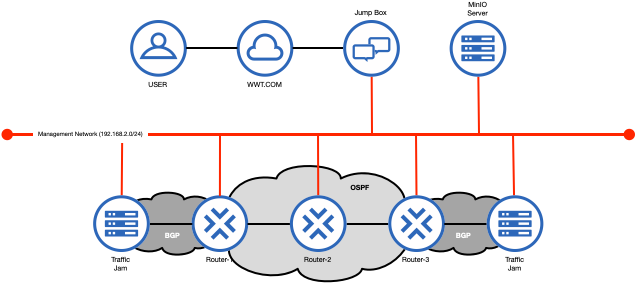

# minio-ansible-pyats-sandbox

Repository for DevNet Create 2020 Workshop:

**Leveraging MinIO’s High Performance Object Storage, Ansible, and pyATS for network change and audit logs**

## Problem Description

Many organizations are requiring vast amounts of data to be collected before, and after, each approved change window.  However, many of the engineers working for these organizations are struggling with how to get started capturing and comparing device state programmatically. In this lab you will be using MinIO, Ansible, and pyATS to capture and validate pre and post-change data from Cisco routers.

## Solution Overview

In this workshop you will accomplish the following:

* Use Ansible and the ansible-pyats role to capture device state from Cisco routers
* Use Ansible and the WWT ATC tool TrafficJam to simulate multiple change windows in the environment
* Leverage MinIO object storage to store device state artifacts generated by Ansible and pyATS
* Use Ansible to compare pre and post-change device state programmatically

## Solution Components

* Ansible - https://www.ansible.com/
  * Ansible is an open-source IT automation engine capable of automating cloud provisioning, configuration management, application deployments, and network infrastructure
  * Ansible is written in Python and easily extended by writing custom modules in any language that can return JSON
* pyATS - https://developer.cisco.com/pyats/
  * pyATS or the Python Automated Test Systems is a Python3 based test automation infrastructure originally developed as an internal Cisco engineering tool, but made available externally through DevNet
* MinIO - https://github.com/minio/minio
  * Object storage is a data storage architecture that manages data as objects as opposed to a file hierarchy or as blocks within sectors and tracks.
  * Object storage allows for retention of massive amounts of unstructured data, as well as the programmatic manipulation of data.
  * MinIO is an open-source cloud storage server that is compatible with Amazon S3 APIs and written in Go.
  * MinIO is hardware agnostic and works on physical, virtualized, or containerized environments.
* WWT TrafficJam - https://www.wwt.com/
  * TrafficJam is a custom virtual router developed by WWT and used in the WWT Advanced Technology Center to provide performance monitoring, route generation and segmentation, circuit impairment, and simulated service provider clouds.

## Lab Topology

## WWT Sandbox

https://www.wwt.com/lab/automated-change-control-validation-lab

### Provided Components

#### compare_routes.yml

Ansible Playbook to Gather and Compare Routing Information

#### compare_prior_changes.yml

Ansible Playbook to Compare Prior Change IDs

#### filter_plugins/filters.py

Ansible Filter to Parse String Data from pyats_diff()

